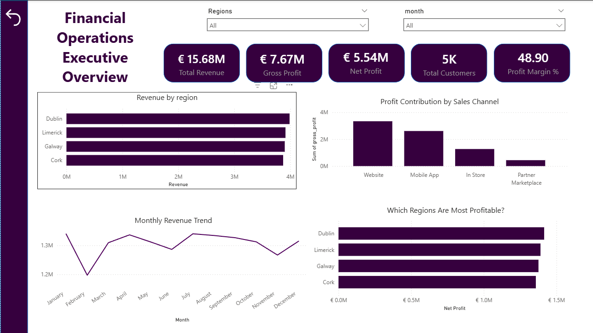

# Financial Operations Analytics Dashboard

## Overview

This project is an end to end financial analytics solution built to simulate real business operations in an ecommerce company.

It combines data engineering, data warehousing, and business intelligence to analyze revenue, cost, profitability, and customer value.

## Tools Used

- Python (data generation and cleaning)
- Google BigQuery (data warehouse)
- SQL (data modeling and transformations)
- Power BI (dashboard and visualization)

## Project Architecture

Raw Data → Python Cleaning → BigQuery Warehouse → SQL Reporting Views → Power BI Dashboard

## Data Model

The project uses a star schema:

Fact Tables:
- fact_sales
- fact_costs

Dimension Tables:
- dim_customers
- dim_products
- dim_date
- dim_region
- dim_channel

## Key Features

- Revenue analysis across channels, regions, and products
- Cost breakdown by department and category
- Profitability analysis including net profit and margins
- Customer lifetime value analysis and segmentation
- Automated data pipeline using Python
- Cloud based warehouse using BigQuery

## Dashboard Pages

### Executive Overview
Summary of revenue, profit, margin, and customers

### Revenue Analysis
Breakdown of revenue by category, product, region, and channel

### Cost Analysis
Analysis of operating costs and key cost drivers

### Profitability Analysis
Comparison of revenue vs profit and margin performance

### Customer Value Analysis
Customer segmentation, retention, and lifetime value insights

## Sample Dashboard



## Key Insights

- Website drives the highest revenue and overall profit
- Mobile App shows strong profitability performance
- Partner Marketplace has lower margins due to higher discounts
- Costs are primarily driven by logistics and marketing
- Repeat customers generate significantly higher lifetime value

## How to Run

1. Generate data:
```bash
python scripts/generate_data.py

2. Clean data:
```bash
python scripts/clean_data.py

3. Load to BigQuery:
```bash
python scripts/load_to_bigquery.py

